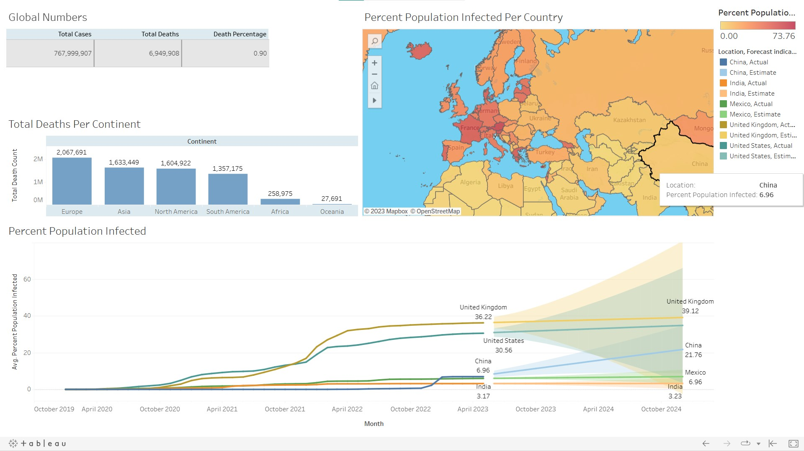
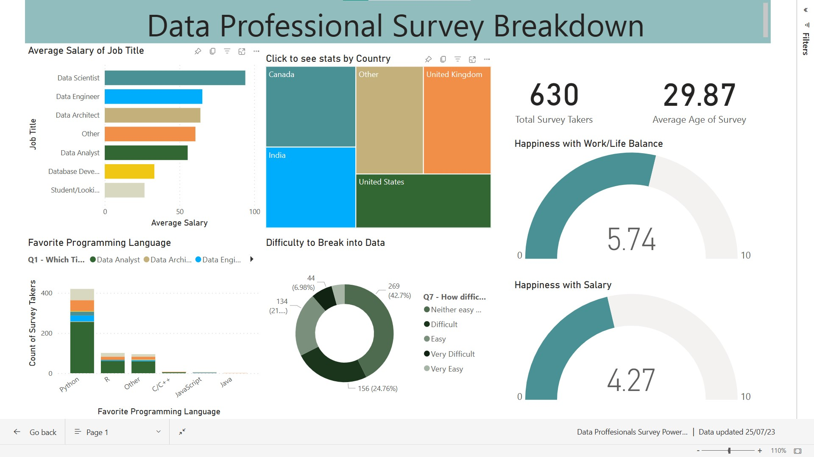

# Projects Descriptions
>This repository hosts the files for my case study from Sql to Python, Tableau to PowerBI, Machine learning and much more
## Table of Contents
* [SQL projects](#sql-projects)
   -Data Cleaning with **MSSQL**  
  -Preparing Covid datas untill today with **MicrosoftSQL**
* [Visualization Covid data with **Tableau**](#tableau-project)
* [Data Professionals Survey **Power BI** report](#powerbi-project)
* [Python Projects](#python-projects)
   -[Famous Movies dataset finding trends and flow in dataset **Python**] 
  -[Cancer Diagnosis Predictions with **Python Machine Learning**] 
  -[Preparing dataset for further analysis Seoul Car Accident dataset **Python**]
* [Amazon Web Scraping with **Selenium Python**](#web-scraping)
* [Project Status](#project-status)
* [Contact](#contact)
* [Korean](#korean)
<!-- * [License](#license) -->
## SQL Projects
Data Exploration of Covid 19 Dataset in SQL Server 
Dataset includes datas from first covid positive case date to June 17th 2023 
Total Cases vs Total Deaths  
Total Cases vs Population  
etc...

## Tableau Project
Dataset is same with Covid project above
Tableau Public [click here](https://public.tableau.com/app/profile/furkan.yagiz/viz/CovidPortfolioProject_16870698928110/Dashboard1?publish=yes) 

## Powerbi Project
630 Data Professionals survey data set which includes people's salary, age, favirote tool to use for data analysis, nationality, happiness with current job etc 
PowerBi app [click here](https://app.powerbi.com/links/ai0Msvl-tF?ctid=86978b30-1660-4119-8aac-fa62bf388ed6&pbi_source=linkShare) 

## Python Projects
Cleaning the Movies dataset with Python Visulazation and Correlation  
Breast Cancer Diagnosis Predictions with Python and comparing algorithms accuracy scores 
Seoul 2021 Car accidents official data preparing for data analysis and more

## Web Scraping
Web Scraping from Amazon with Microsoft Edge Selenium Python library and and making a csv data file which includes price name etc...

## Project Status
R Project is: _in progress_  
TensorFlow Project is:  _in progress_ 

## Contact
[Contact](https://www.linkedin.com/in/furkanbyagiz/) - feel free to contact me!

## Korean
__아직 확인 중__

<!-- Optional -->
<!-- ## License -->
<!-- This project is open source and available under the [... License](). -->

<!-- You don't have to include all sections - just the one's relevant to your project -->
